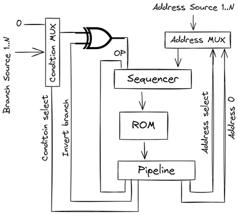

# Microcode Sequencer



This directory contains a general purpose microcode sequencer in Verilog influenced by the [Am2911](https://bitsavers.org/components/amd/bitslice/1978_The_Am2900_Family_Data_Book.pdf) bit slice sequencer described in [Bit-Slice Microprocessor Design](https://bitsavers.org/components/amd/bitslice/Mick_Bit-Slice_Microprocessor_Design_1980.pdf) by John Mick and Jim Brick.

There are a few differences in this design:

* Scalable design, rather than a series of bit-slices
* Built in adder to support relative only branching (position independent code)

## Microprogramming

Prof. [M. V. Wilkes](https://en.wikipedia.org/wiki/Maurice_Wilkes) of the Cambridge University Mathematical Laboratory coined the term microprogramming in 1951. He provided a systematic [alternative procedure](https://people.eecs.berkeley.edu/~culler/courses/cs252-s05/papers/wilkes52.pdf) for designing the control unit of a digital computer. During instruction executing a machine instruction, a sequence of transformations and transfer of information from one register in the processor to another take place. These were also called the micro operations. Because of the analogy between the execution of individual steps in a machine instruction to the execution of the individual instruction in a program, Wilkes introduced the concept of microprogramming. The Wilkes control unit replaced the sequential and combinational circuits of a [hardwired control unit](https://en.wikipedia.org/wiki/Control_unit#Hardwired_control_unit) by a programmable control unit in conjunction with a storage unit that stores the sequence of steps of instruction that is a micro-program.

Hardwired control units execute efficiently, but their design, implementation, and modification can be time consuming and difficult to maintain. The control unit is designed as a combinational circuit and a state machine. The state machine can take the form of either a [Moore](https://en.wikipedia.org/wiki/Moore_machine) or [Mealy](https://en.wikipedia.org/wiki/Mealy_machine) machine. Each CPU instruction might require as many 16 or more states, corresponding to as many lines of a microprogram.

## High Level Compiler

Historically, writing microcode was one step below assembly language programming. High level flow control structures, such as if/else, do/while loops, switch statements, and procedures would simplify the process. To this end, a compiler translates these flow control structures into microcode.

# Tools

* Python 3
* [Icarus Verilog](https://bleyer.org/icarus/)
* make (winget install ezwinports.make)

## Debugging

* Enable instruction tracing in CPU.v:

```
`define TRACE_I 1
```

* Microcode tracing:

```
, uc_debug = 1;
```

* Icarus Verilog [interactive mode](https://steveicarus.github.io/iverilog/usage/vvp_debug.html)
* $stop suspends simulation in interactive mode

```
$ make run
> cd CPUTestBench
> cd cpu
> $display a
```

TODO:

* BAL instruction
* Load instructions, e.g. LH, LW
* Fix broken tests
* Add if continue statement
* Check for overlapping field assignments (Generator)
